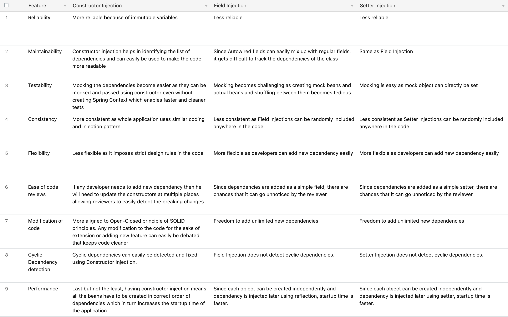
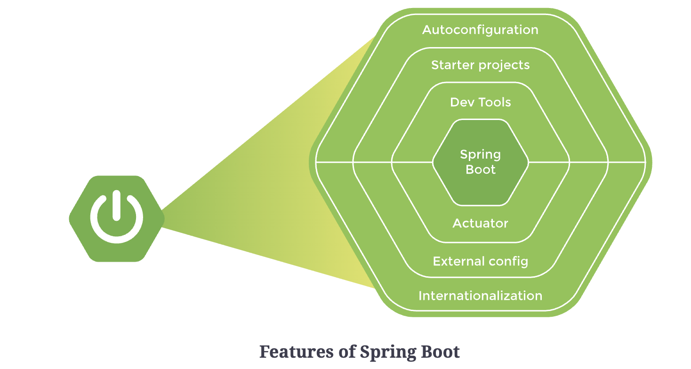

# Spring Basics

Spring automates the process of creating objects and binding them together. It takes the responsibility of creating
instances of classes and binding instances based on their dependencies. The instances or objects that Spring manages are
called **beans**. To manage objects and dependencies, Spring requires information about three things:

- Beans (eg, `@Component`)
- Dependencies (eg, `Autowired`)
- Location of beans (eg, `@ComponentScan`)

The Spring container is responsible for instantiating, configuring and assembling objects known as beans, as well as
managing their life cycles. IoC container is a generic term. It is not framework specific. Spring offers two
implementations of the IoC container:

- **Bean factory**
- **Application context**

**Dependency Injection** in Spring can be done through constructors, setters or fields

<br/>

## `@Bean`

Bean is an instance of a Java object managed by a Spring IoC (Inversion of Control) container. `@Bean` is a method-level
configuration annotation.

### Bean Lifecycles

- `init()` and `destroy()` in XML Config
- Implement interfaces `InitializingBean` and `DisposableBean`
- Annotations `@PostContruct` and `@PreDestroy`

> The Spring container creates the prototype beans and hands them over when requested. Thereafter, it is the responsibility of the application to destroy the bean and free up any resources that it has acquired. Hence in case of prototype beans the `@PostConstruct` is only invoked, not the `@PreDestroy`

<br/>

## Bean scope

### **`@Scope`** helps define the scope of a Bean

- *singleton*: A single instance of the object created per Spring IoC. This is the default scope for every spring bean
- *prototype*: A new instance of the object created every time a request is made to the bean
- *request*: A new instance of the object is created for every single HTTP request, and the same will be used throughout
  the lifecycle of the HTTP request
- *session*: A new instance of the object is created and used throughout the lifecycle of every HTTP session
- *application*: A new instance of the object is created and used throughout the lifecycle of the global HTTP session
- *websocket*:
  > - `@Scope` can be added for `@Bean`, `@Component`, `@Service`, `@Controller`, `@RestController`, etc.
  > - By default, *when a prototype bean is injected into a singleton bean, it loses its prototype behavior and acts as a singleton*.
  > - If we use `@Scope(value=ConfigurableBeanFactory.SCOPE_PROTOTYPE, proxyMode=ScopedProxyMode.TARGET_CLASS)` on the Prototype bean, then new instances are created for each request of the bean.

<br/>

## Stereotype Annotations

### **`@Component`**

- `@Service` – for indicating that the annotated class acts as a “Business Service Facade”.
- `@Repository` – for indicating that the class acts as a Database Access Object (DAO) for accessing and manipulating
  the persisted data.
- `@Controller` – is used to define a controller in the web layer. Spring scans a class with `@Controller` to find
  methods that are mapped to different HTTP requests. It makes sure that the right view is rendered to the user.
- `@RestController` – it is a specialized form of `@Controller`. It is a convenience controller that infers the response
  body from the return type of the request handling method, instead of handling explicitly for every single method.
- `@Configuration` – for indicating that the annotated class is for configuration or for holding configuration methods,
  like `@Bean` annotated methods.
  > - Methods annotated with `@Bean` are initialized at the start of the application (ie., eager initialization). They can be annotated with `@Lazy` to initialize when they are referenced for the first time.

### Benefits of using specific Stereotype annotations

- The advantage of having annotations specific to every layer instead of the generic `@Component` is in Aspect Oriented
  Programming (AOP). We can identify the annotations and add functionality to specific annotations. Similarly, we can
  classify components in different categories and apply a specific logic to each category. For example, if we want to
  log everything that is coming from the business layer, we can identify objects with the `@Service` annotation using
  AOP and log all the content.
- Spring provides a default exception translation facility for JDBC exceptions if the `@Repository` annotation is used.
  This feature cannot be used on beans annotated with `@Component`. When using a persistence framework like Hibernate,
  exceptions thrown in a class with the `@Repository` annotation are caught and automatically translated into
  Spring’s `DataAccessException` class.
- Likewise, the request mapping feature is enabled only when using the `@Controller` annotation. The DispatcherServlet
  automatically looks for `@RequestMapping` for classes marked with the `@Controller` annotation only.

<br/>

## Dependency Injection

Contexts & Dependency Injection (CDI) for Java EE defines different annotations like `@Inject`, `@Named`, `@Scope`
, `@Singleton`, etc. Spring supports most of the annotations defined by CDI.

- `@Component` -> `@Named`
- `@Inject` -> `@Autowire`
- `@Qualifier`, `@Scope`, and `@Singleton` are same in both.

### Types of DI in Spring

- Field Injection
- Constructor Injection
- Setter Injection

### Field Injection

- XML
    - by Type
    - by Name
    - by Constructor
- Annotations
    - `@Autowired`
    - `@Qualifier`
    - `@Primary`

- #### Resolving Autowiring Conflict
    - Conflicts can be resolved if we use the variable name same as the implementation component (in camel case) while
      autowiring.
    - If an implementation component is annotated with `@Primary`, then that takes precendence if all other
      implementation components are *ONLY* annotated with `@Component`.
    - If a component has been annotated with `@Qualifier` and the same is specified during autowiring then that takes
      precendence over `@Primary`

  > `@Autowired` annotation resolves dependencies by type. If there are more than one beans of the same type, a conflict arises. They can be resolved using the `@Primary` annotation, renaming the variable to match the name of the class, or by using the `@Qualifier` annotation.

### Constructor Injection

- This is the most preferred way of injecting dependencies. When a component is being initialized it needs the required
  dependencies also to be initialized.
- To use constructor for injecting dependencies, we can move the `@Autowired` annotation to the constructor.
  The `@Qualifier` annotation cannot be used on the constructor (as it results in an error
  message: `"The annotation @Qualifier is disallowed for this location"`), rather, it should be used in the argument
  list right in front of the property that we want to be autowired.
- Use of `@Autowired` annotation is optional in case of constructor injection.

### Setter Injection

- This is using a setter method for each dependency that we want to add to a given component. This adds more boilerplate
  code.
- It is similar to Field Injection but here setter is Annotated with `@Autowired` tag.

> Circular dependency issue arises when using constructor injection because the beans are created when the context is loaded. If using setter or field injection, the beans are created but their dependencies are injected only when they are needed. Thus the circular dependency issue can be avoided. When using constructor injection, `@Lazy` annotation can be used. This tells spring that when initializing the bean, inject a proxy. The bean is fully created only when it is needed.

> - Field Injection uses reflection to set the values of private variables
> - Constructor Injection happens at the time of creating the object itself
> - Setter Injection uses setters to set the value
> - Constructor Injection is always the first choice when it comes about Dependency Injection because of its reliable and strict nature.
> - Field Injection can also be used in the scenarios where Constructor Injection is absolutely not possible (and Circular Dependencies have to be avoided even as a work around).

<br/>

### Comparison of Constructor, Field and Setter Injections



<br/>

## Spring Configuration

- XML Based Configuration
- Annotation Based Configuration
- Java Based Configuration

## Configuration Management

### Maintaining Profiles

- Spring Boot allows us to maintain configuration files of different profiles in the
  format `application-<profile>.properties`, and these properties’ files need to be present in `src/main/resources`.
- To activate a profile, we can set the property `spring.profiles.active=dev` in `application.properties`, where dev can
  be replaced with the desired profile name.
- We can also annotate beans to be created only when the active profile is set to a certain profile.

  ```Java
    @Profile("dev") 
    @Bean
    public DataSource devDataSource() {
      //.....
    }

    @Profile("prod") 
    @Bean
    public DataSource prodDataSource() {
      //.....
    }
  ```

### Externalizing Configurations

- We can mention the name of a properties file from where to fetch the value using the `@PropertySource` annotation. By
  default, Spring loads the property file from the classpath.
- In the below example we see how we can externalize our configuration properties file
  under `src/main/resources/custom.properties`:
    ```
      prop.name = educative
      prop.age = 10
    ```

    ```Java
      @Value("${prop.name}")
      private String name;

      @Value("${prop.age}")
      private int age;

      // If not found, assign default value `Male`
      @Value("${prop.gender:Male}")
      private String gender;

      // fetch value of `server.port` from `application.properties` with default value `9090` 
      // where `environment` represents the bean id corresponding to property source `application.properties`
      @Value("#{environment['server.port'] ?: 9090}")
      private int port;

      // creating a bean with values from `custom.properties` passed as argument
      @Bean
      public Person person(@Value("${prop.name}") String name, @Value("${prop.age}") int age) {
        return new Person(name, age);
      }
    ```

<br/>

## `@SpringBootApplication` Annotation

`@SpringBootApplication` is equivalent to the following three annotations:

- `@Configuration`, which declares a class as the source for bean definitions
- `@EnableAutoConfiguration`, which allows the application to add beans using classpath definitions, i.e.,
  auto-configuring the application depending on the dependencies that are added.

  Example – We have added the in-memory H2 database. The necessary data source creation at the time of application
  bootup using the configurations provided in `src/main/resources/application.properties` or command-line arguments, if
  any, etc.
- `@ComponentScan`, which directs Spring to search for components in the path specified. By default, the package name is
  the same as the package name of the class in which the annotation is present. Spring detects all classes marked
  with `@Component`, `@Repository`, `@Service`, and `@Controller` annotations during component scan. We can also exclude
  certain configuration-annotated classes from the scanned packages, like this –

  `@SpringBootApplication(exclude = { DataSourceConfiguration.class })`

  > `@SpringBootApplication` = `@Configuration` + `@EnableAutoConfiguration` + `@ComponentScan`

<br/>

## Spring Application Configuration

When we are not using the `spring-boot-starter` dependency then we need to add the following dependencies as and how
required:

- `spring-core`: Provides fundamental features of Spring framework like dependency injection and Inversion of Control.
- `spring-context`: In order to use `ApplicationContext`.
- Need to specify `@Configuration` and `@ComponentScan` as `@SpringBootApplication` will no longer work
- `AnnotationConfigApplicationContext` needs to be defined instead of `SpringApplication` in the `main()` method to get
  the application-context.

<br/>

## SpringBoot

### Features

- Spring boot enables robust creation of applications. It provides features like servers, metrics, heath checks, etc.
  Spring Boot allows for integration with many different servers, but by itself, it is neither an application server nor
  a web server. Auto configuration is a great feature of Spring Boot whereby it provides all the required dependencies
  to start a particular project. For example, starter web automatically configures everything needed for a web
  application. Similarly, starter JPA automatically configures basic JPA along with Hibernate

  

### Springboot autoconfiguration

- Without Spring Boot, creating a simple web application can be a daunting and time-consuming task. When creating a
  project, the frameworks required need to be decided along with the versions of the frameworks that are compatible with
  each other. Spring Boot does that work for us. It has already created a set of dependencies with compatible versions.
  The developer only needs to choose the uber dependency (like starter web) and Spring Boot configures appropriate
  versions of Spring core, dispatcher servlet, view resolver, logging, security and validation frameworks along with
  exception handling and support for internationalization. Spring Boot takes care of the configuration part for us so we
  can focus on developing the business logic.

### Starter projects

- **Starter web** is the preferred starter for building web applications, including RESTful applications, using Spring
  MVC. It uses Tomcat as the default embedded container. `spring-boot-starter-web` has a number of dependencies
  including `spring-web`, `spring-webmvc`, `starter-tomcat`, and `starter-json` for conversion to JSON when a web
  service is invoked.
- **Starter test** is the starter dependency for testing Spring Boot applications with libraries including JUnit
  Jupiter, Hamcrest, and Mockito. `spring-boot-starter-test` enables the developer to write unit and integration tests.
- **Starter JPA** is another frequently-used starter project. JPA is the interface for the Hibernate
  framework. `starter-data-jpa` is used for Spring Data JPA with Hibernate. The pom.xml file shows that it has a
  dependency on `spring-boot-strater-aop`, `spring-boot-starter-jdbc`, `hibernate-core`, and `transaction-api`.

### Spring Actuator

- Spring Boot Actuator is a feature that provides **monitoring features** for the application during development and
  after deployment. It provides metadata about the application like the beans configured, how autoconfiguration has
  worked, how many times a specific service is called, how many times a specific service has failed, etc.
- `/actuator` endpoint actually provides details about -
    - Audit events
    - Beans
    - Health
    - Http Trace
    - Mappings
    - Metrics
    - Thread dump

### Spring Boot JDBC

Spring Boot simplifies development and makes JDBC programming easy. JDBC with Spring Boot offers the following
advantages over JDBC with Spring:

- When using Spring Boot, only one dependency (`spring-boot-starter-jdbc`) is needed in the `pom.xml` file as compared
  to multiple dependencies in Spring (`spring-context`, `spring-jdbc`, etc.).
- Spring Boot automatically initializes the datasource bean whereas it needs to be created using XML or Java
  configuration in Spring.
- Spring Boot also autoconfigures the `JdbcTemplate` and other template beans that need to be explicitly registered in
  Spring.
- Lastly, Spring Boot automatically creates the database schema specified in the `schema.sql` file. The schema needs to
  be explicitly configured if Spring is used.
- The `RowMapper` is executed for every row. It keeps looping over the result set and makes it available one row at a
  time. On the other hand, the `ResultSetExtractor` fetches all the records at once.

> - `RowMapper` is used when each row maps to a single object, e.g., return a list of players along with their country.
> - If we need to map multiple rows returned by a query to a single object, `ResultSetExtractor` is the appropriate choice, e.g., return a list of countries along with the number of players from that country. `ResultSetExtractor` allows manipulation of data as all rows of the result set are available at once.

### Spring Data JPA

- Java Persistence API (JPA) is an interface that defines a mapping between relations and objects. It defines how a Java
  object is mapped to a database table. JPA provides a mechanism to query the database and provide the results back as a
  collection of Java objects or provide Java objects to be stored in the database. The underlying ORM implementation
  converts these API calls to SQL queries.
- Spring Data JPA is a part of Spring Data project. It is not a JPA implementation. Spring Data JPA uses Hibernate as
  the default JPA implementation.
- Spring Data JPA contains JPA repositories which define query methods. This eliminates the need to write common
  queries. The name of the method declared in the repository interface is automatically converted into low level SQL
  queries by Spring.
- Hibernate is by far the most popular JPA implementation. It existed even before JPA came into existence and has a lot
  more to it than being a JPA implementation. Hibernate makes creating queries under the hood and interacting with
  databases easy.

<br/>

## Calling a Rest Service

### `RestTemplate`

- https://www.baeldung.com/rest-template

### `WebClient`

- Need to add the `spring-boot-starter-webflux` dependency
- https://www.baeldung.com/spring-5-webclient

<br/>

<br/>

# Unit Testing

`spring-boot-starter-test` come with some dependencies that help us in doing unit testing:

- **Mockito** is used for mocking data and objects
- **JSONAssert** is used to compare and validate jsons
- **WebMvcTest** provided by Spring is used to test Controllers. Along with **MockMvc** we can test controllers.

## Mockito

- `mock(Sample.class)` is used to mock a `Sample` class
- `when()` and `thenReturn()` methods are used to mock values on some methods
- We can mock values with specific argument values when calling `when()`
- **Argument Matchers:** We can use `anyInt()`, `anyString()`, etc within the arguments of the mocked method to allow any value of `int`
  , `String`, etc.
- `verify()` is useful when we want to know how many times a particular method is called with a specific value. There are some helper methods that we can pass in `verify()` to specify the number of times the method is called.

  ```java
    verify(mockList).get(0); // If times is not passed, by default it is 1
    verify(mockList, times(2)).get(anyInt());
    verify(mockList, atLeast(1)).get(anyInt());
    verify(mockList, atLeastOnce()).get(anyInt());
    verify(mockList, atMost(2)).get(anyInt());
    verify(mockList, never()).get(3);
  ```
- **Argument Capture:**  
  

